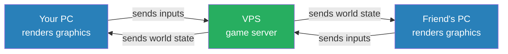

# Game Server Setup

Running Satisfactory and Subnautica 2 dedicated servers on a self-hosted Linux VPS. No GPU required — dedicated servers handle game logic and networking, not rendering.

> **Prerequisite:** Complete [SSH Hardening](ssh-hardening.md) before starting this guide.

---

## How a Dedicated Server Works



The server simulates the world — physics, player positions, saves. Each client renders their own view locally. This is why no GPU is needed on the server.

---

## Phase 2 — Docker Base Stack

### Why Docker for game servers?

Each game server runs in an isolated container — start, stop, and update independently without touching anything else on the server. Adding a new game is one `docker run` command. Cleanup is clean — `docker rm` and it's gone.

### Install Docker Engine

```bash
# Remove any old versions
sudo apt remove -y docker.io docker-doc docker-compose podman-docker containerd runc

# Add Docker's official GPG key
sudo apt install -y ca-certificates curl
sudo install -m 0755 -d /etc/apt/keyrings
sudo curl -fsSL https://download.docker.com/linux/ubuntu/gpg -o /etc/apt/keyrings/docker.asc
sudo chmod a+r /etc/apt/keyrings/docker.asc

# Add Docker repo
# Note: use 'noble' (24.04 codename) — Docker repo may not have 26.04 entry yet
echo "deb [arch=$(dpkg --print-architecture) signed-by=/etc/apt/keyrings/docker.asc] https://download.docker.com/linux/ubuntu noble stable" | sudo tee /etc/apt/sources.list.d/docker.list > /dev/null

sudo apt update
sudo apt install -y docker-ce docker-ce-cli containerd.io docker-buildx-plugin docker-compose-plugin
```

### Add your user to the docker group

```bash
sudo usermod -aG docker <username>
# log out and back in for group change to take effect
```

### Verify

```bash
docker run hello-world
docker --version
docker compose version
```

---

## Phase 3 — Satisfactory Dedicated Server

> Coming soon: SteamCMD install, App ID 1690800, systemd service, port configuration

---

## Phase 4 — Subnautica 2

> Coming soon
