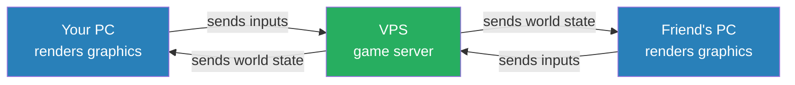

# Game Server Setup

Running Satisfactory and Subnautica 2 dedicated servers on a self-hosted Linux VPS. No GPU required — dedicated servers handle game logic and networking, not rendering.

> **Prerequisite:** Complete [SSH Hardening](ssh-hardening.md) before starting this guide.

---

## How a Dedicated Server Works

The server simulates the world — physics, player positions, saves. Each client renders their own view locally. This is why no GPU is needed on the server.

---

## Phase 2 — Docker Base Stack

> Coming soon

---

## Phase 3 — Satisfactory Dedicated Server

> Coming soon: SteamCMD install, App ID 1690800, systemd service, port configuration

---

## Phase 4 — Subnautica 2

> Coming soon
