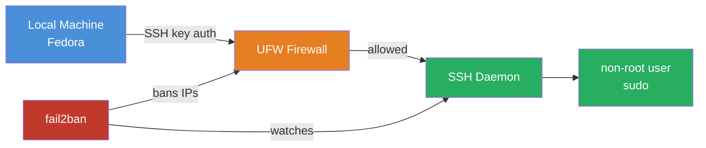
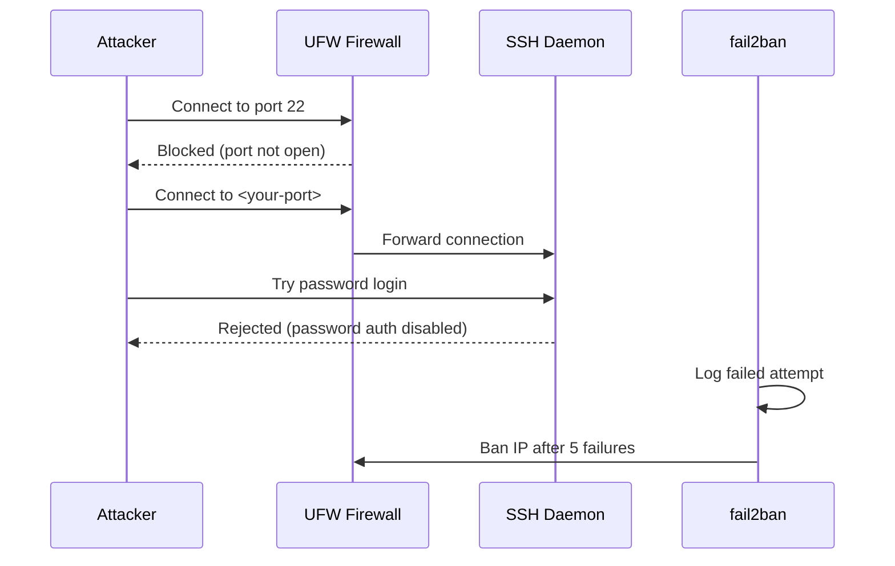
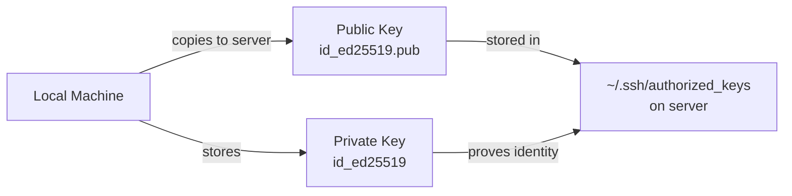
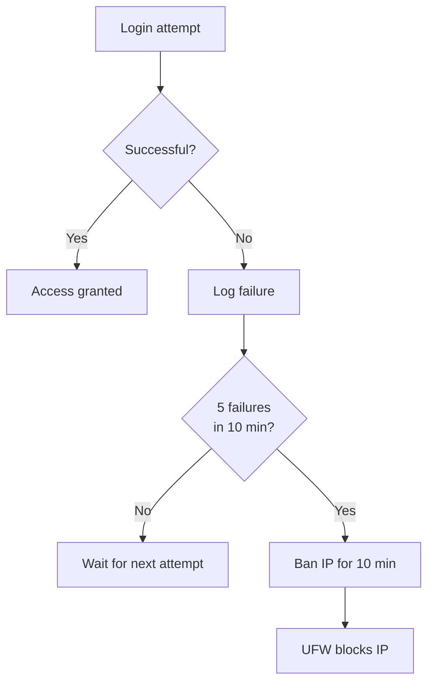

# SSH Hardening

A fresh VPS on a public IP gets hit by automated scanners within minutes. They try default credentials on port 22 continuously. This guide turns your server from an open target into a locked door.

---

## Architecture



**What this achieves:**
- Only SSH key holders can connect — no password brute-force possible
- SSH moved off port 22 — eliminates automated scan noise
- UFW blocks everything except explicitly allowed ports
- fail2ban bans IPs that repeatedly fail authentication

---

## What happens when an attacker hits your server



---

## Step 1 — Create a non-root sudo user

**Why:** Running as root means every command runs with full system privileges — one mistake wipes your server. A sudo user lets you run privileged commands intentionally, not by default.

```bash
adduser <username>
usermod -aG sudo <username>
groups <username>
# expected: <username> : <username> sudo users
```

---

## Step 2 — Generate SSH key on local machine

**Why:** Passwords can be guessed or brute-forced. SSH keys are cryptographic — a 256-bit ed25519 key cannot be brute-forced in any practical timeframe. `ed25519` is preferred over the older `rsa` — smaller, faster, more secure.

```bash
ssh-keygen -t ed25519 -C "<username>@<hostname>"
cat ~/.ssh/id_ed25519.pub
```

This generates two files:
- `~/.ssh/id_ed25519` — private key, never leaves your machine
- `~/.ssh/id_ed25519.pub` — public key, goes on the server



---

## Step 3 — Copy public key to server

**Why:** The server stores your public key. When you connect, your local machine proves it holds the matching private key without ever sending it. The server verifies the proof cryptographically.

```bash
ssh-copy-id -i ~/.ssh/id_ed25519.pub <username>@<server-ip>
```

---

## Step 4 — Test key login

**Why:** Always verify key auth works before disabling passwords. If you disable password auth without confirming key auth works, you lock yourself out permanently.

```bash
ssh <username>@<server-ip>
# should connect using key, not password
```

---

## Step 5 — Harden SSH config

**Why each setting matters:**

| Setting | Value | Reason |
|---|---|---|
| `PermitRootLogin` | `no` | Root has no login history, no accountability. Always use a named user. |
| `PasswordAuthentication` | `no` | Eliminates brute-force attacks entirely. Key or nothing. |
| `Port` | non-22 | Stops 99% of automated scanners that only target port 22. |

```bash
sudo vi /etc/ssh/sshd_config
```

```
PermitRootLogin no
PasswordAuthentication no
Port <your-port>
```

> **Ubuntu 26.04 gotcha:** Cloud images ship `/etc/ssh/sshd_config.d/50-cloud-init.conf` with `PasswordAuthentication yes`. Files in `sshd_config.d/` take precedence over the main config — your `no` gets silently overridden. Always check and patch this file too.

```bash
sudo cat /etc/ssh/sshd_config.d/50-cloud-init.conf
# if it says PasswordAuthentication yes, change it to no
sudo vi /etc/ssh/sshd_config.d/50-cloud-init.conf
```

---

## Step 6 — Validate config before restarting

**Why:** A syntax error in sshd_config will prevent SSH from restarting. You lose remote access. Always validate first.

```bash
sudo sshd -t
# no output = valid config
```

---

## Step 7 — Open firewall port before restarting SSH

**Why:** If you restart SSH on the new port before UFW allows it, you lock yourself out. Always open the port first.

```bash
sudo apt install -y ufw
sudo ufw allow <your-port>/tcp
sudo ufw enable
```

---

## Step 8 — Restart SSH

**Why `ssh.socket` not `ssh`:** Ubuntu 26.04 uses systemd socket activation. The socket listens on the port and hands off connections to the SSH daemon. Restarting just `ssh` doesn't pick up port changes — you must restart `ssh.socket` and reload systemd.

```bash
sudo systemctl daemon-reload
sudo systemctl restart ssh.socket
```

**Test in a second terminal before closing your current session:**

```bash
ssh -p <your-port> <username>@<server-ip>
```

Only close the original session after confirming the new connection works.

---

## Step 9 — Install fail2ban

**Why:** Even with password auth disabled, bots still hammer your SSH port. fail2ban watches authentication logs and automatically bans IPs after repeated failures. Reduces log noise and protects against zero-day SSH vulnerabilities.



```bash
sudo apt install -y fail2ban
sudo systemctl enable --now fail2ban
sudo fail2ban-client status
# expected: 1 jail active (sshd)
```

---

## Step 10 — SSH config alias on local machine

**Why:** Typing `ssh -p <your-port> <username>@<server-ip>` every time is friction. An SSH config entry lets you use a short hostname, and a shell alias makes it a single memorable command.

Add to `~/.ssh/config` on your local machine:

```
Host ssdnode
    HostName <server-ip>
    User <username>
    Port <your-port>
    IdentityFile ~/.ssh/id_ed25519
    ServerAliveInterval 60
    ServerAliveCountMax 3
```

`ServerAliveInterval 60` sends a keepalive ping every 60 seconds. `ServerAliveCountMax 3` disconnects cleanly after 3 missed pings instead of hanging. Without this, idle SSH sessions drop with `Broken pipe` errors — the server is fine but your terminal freezes.

Add alias to `~/.zshrc`:

```bash
echo "alias ssh-connect='ssh ssdnode'" >> ~/.zshrc
source ~/.zshrc
```

Now `ssh-connect` drops you straight into the server from anywhere.
